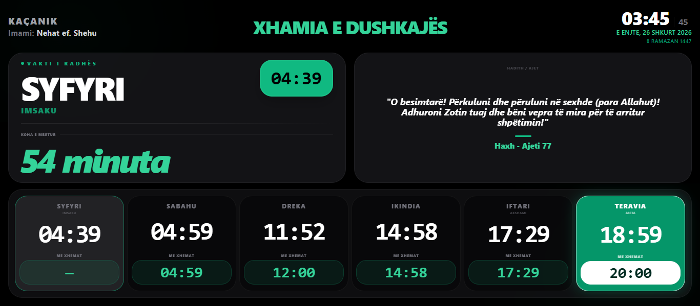
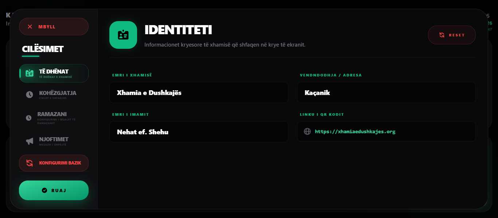
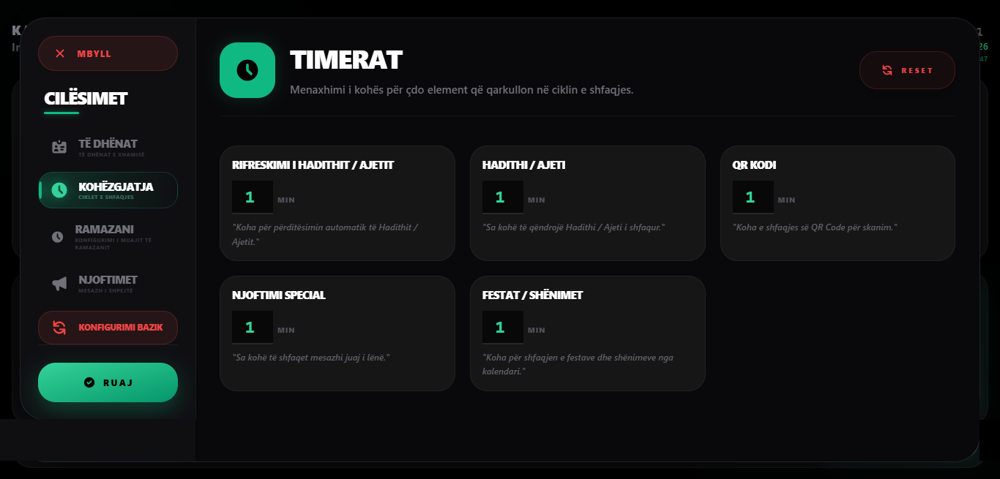
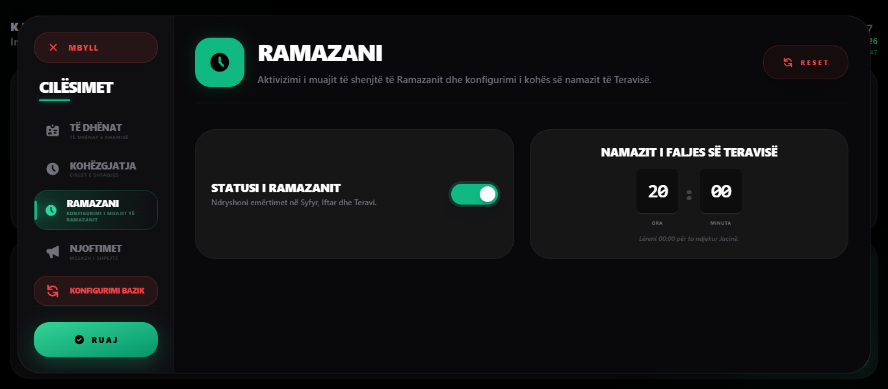
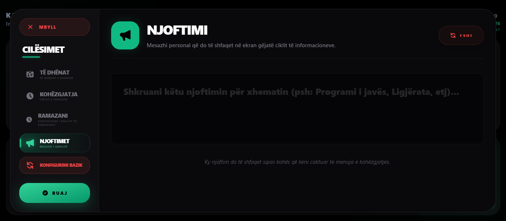

# MosqueScreenTV 🕌📺



**MosqueScreenTV** është një platformë profesionale, moderne dhe jashtëzakonisht e optimizuar për shfaqjen e informacioneve në ekranet e xhamive. E ndërtuar posaçërisht për qëndrueshmëri 24/7, kjo platformë transformon çdo Smart TV në një qendër informative estetike dhe funksionale për xhematin.

---

## ✨ Karakteristikat Kryesore

| Karakteristika | Përshkrimi |
| :--- | :--- |
| **⌚ Kohët e Namazit** | Sinkronizim automatik me vaktet e sakta të namazit dhe kohët e xhematit. |
| **📜 Hadithe & Njoftime** | Cikël dinamik shfaqjeje për Hadithe, Ajete, Festat dhe Njoftimet Speciale. |
| **🚀 Ultra-Optimized** | Ndërfaqe e lehtë dhe hardware-accelerated, e projektuar për **low-end Smart TV**. |
| **🛡️ Stabilitet 24/7** | Mirëmbajtje automatike (3 AM reload) dhe menaxhim i memories për operim pa ndërprerje. |
| **🎮 Remote Control** | Mbështetje e plotë për telekomandën e TV (Enter/OK për cilësimet). |
| **⚙️ Paneli i Cilësimeve** | Panel i integruar direkt në ekran për modifikimin e emrave, kohëzgjatjeve dhe Ramazanit. |

---

## 🛠️ Optimzimet për TV

Aplikacioni është "hardened" për hardware të limituar:
- **Zero Lag Rendering:** Përdorimi i `React.memo` dhe izolimi i orës parandalon re-renderimet e panevojshme.
- **Hardware Acceleration:** Çdo komponent shfrytëzon GPU-në e TV për lëvizje të lëmuara.
- **Data-Driven:** Imsaku, Sabahu, Dreka, Xhumaja, Ikindia, Akshami dhe Jacia llogariten lokalisht pa vonesa rrjeti.
- **Smart Logic:** Sistemi kupton automatikisht vaktin e radhës, kohën e mbetur dhe prioritetin e njoftimeve.

---

## 🚀 Mënyrat e Ekzekutimit

### 🌍 1. Versioni Live (Rekomanduar)
Mënyra më e shpejtë për ta përdorur direkt në TV përmes browser-it.
🔗 **Linku:** [**tv.rilindkycyku.dev**](https://tv.rilindkycyku.dev)

### 🛠️ 2. Zhvillimi Lokal (Self-Hosted)
Për modifikime të kodit ose përdorim në rrjetin lokal pa internet:

1. **Instaloni varësitë:**
   ```bash
   npm install
   ```
2. **Nisni serverin:**
   ```bash
   npm run dev
   ```

---

## 📂 Kontrolli i Cilësimeve

Për të hapur panelin e kontrollit direkt në TV:
- **Telekomanda:** Shtypni butonin **Enter** ose **OK**.
- **Tastiera:** Shtypni tastin **S** ose **M**.

Nga paneli mund të ndryshoni:
- Emrin dhe adresën e xhamisë.
- Linkun e QR Kodit për njoftime.
- Kohëzgjatjen e ciklove (Sa gjatë të qëndrojë Hadithi, QR Kodi, etj).
- **Modulin e Ramazanit:** Aktivizimi i emërtimit Syfyr/Iftar dhe kohës së Teravisë.

### 📸 Pamjet e Cilësimeve

| Të Dhënat | Timerat |
| :---: | :---: |
|  |  |
| **Ramazani** | **Njoftimet** |
|  |  |

---

## 📄 Teknologjitë
- **React 18** (UI Library)
- **Vite** (Next Generation Bundler)
- **Tailwind CSS** (Styling)
- **Lucide & React Icons** (Visuals)

---

## 📄 Licenca
Ky projekt është krijuar me përkushtim për komunitetin musliman. Mund të përdoret, modifikohet dhe shpërndahet lirisht për qëllime mirëbërësie.

---
*Punuar me ❤️ nga [Rilind Kyçyku](https://github.com/rilindkycyku)*
