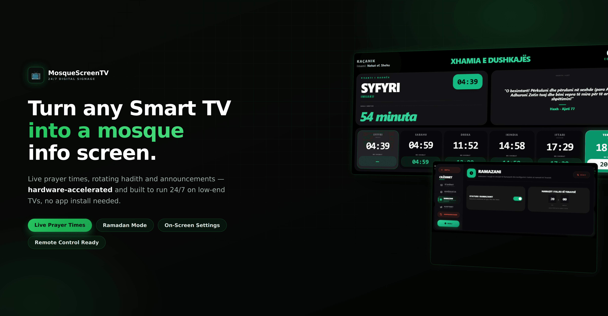
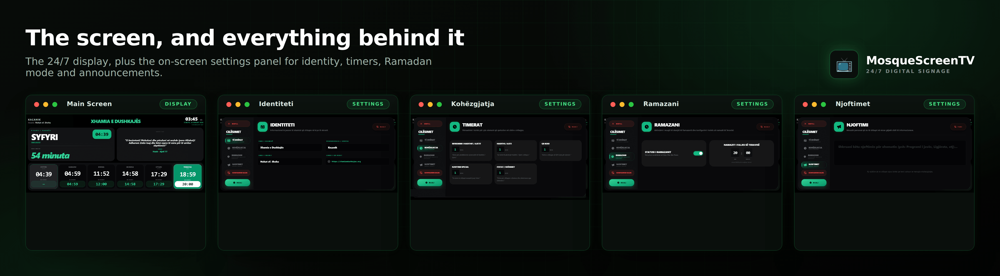
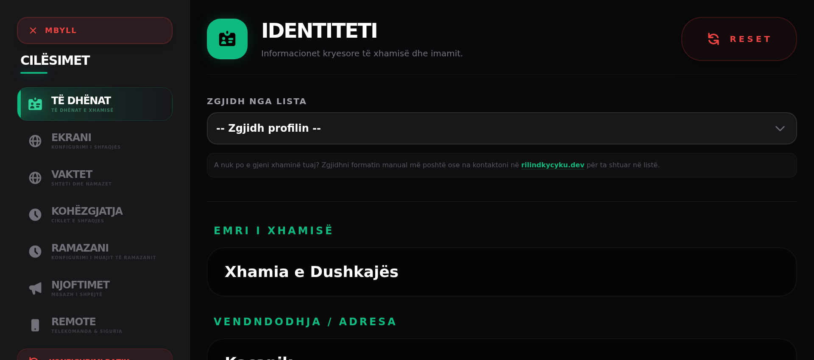
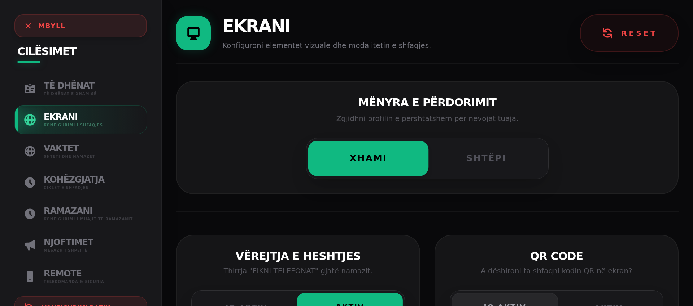
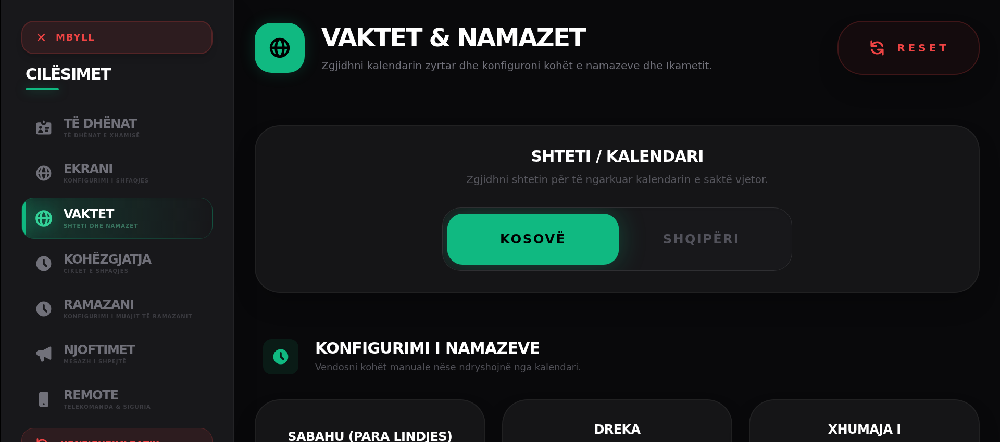
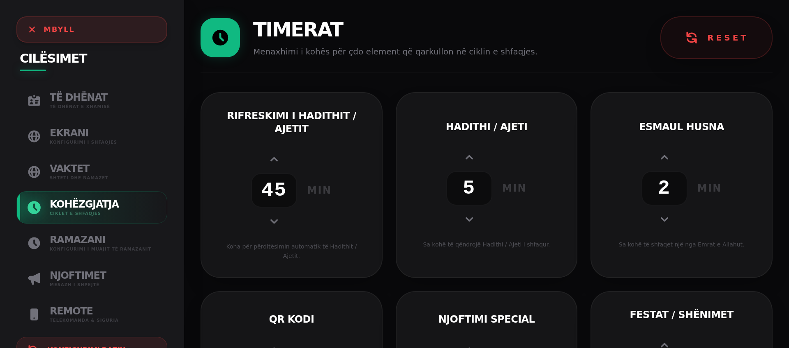
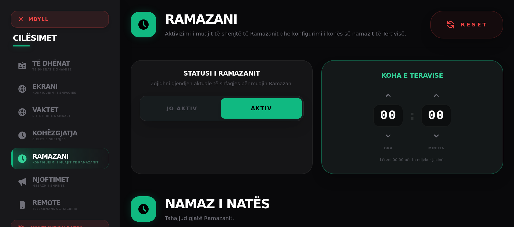
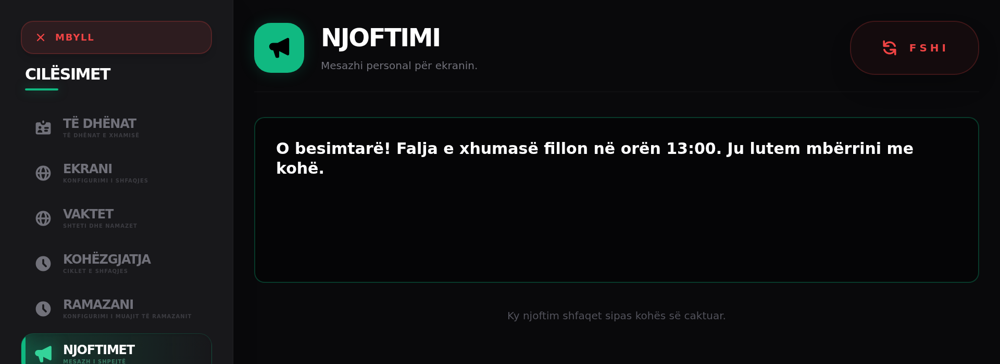
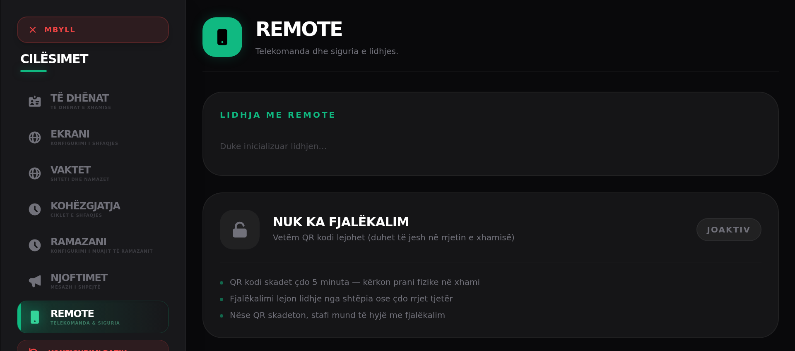

# MosqueScreenTV 🕌📺



**MosqueScreenTV** është një platformë profesionale, moderne dhe jashtëzakonisht e optimizuar për shfaqjen e informacioneve në ekranet e xhamive. E ndërtuar posaçërisht për qëndrueshmëri 24/7, kjo platformë transformon çdo Smart TV në një qendër informative estetike dhe funksionale për xhematin.

---

## ✨ Karakteristikat Kryesore

| Karakteristika | Përshkrimi |
| :--- | :--- |
| **⌚ Kohët e Namazit** | Sinkronizim automatik me vaktet e sakta të namazit dhe kohët e xhematit. |
| **📜 Hadithe & Njoftime** | Cikël dinamik shfaqjeje për Hadithe, Ajete, Festat dhe Njoftimet Speciale. |
| **🚀 Ultra-Optimized** | Ndërfaqe e lehtë dhe hardware-accelerated, e projektuar për **low-end Smart TV**. |
| **🛡️ Stabilitet 24/7** | Mirëmbajtje automatike (3 AM reload) dhe menaxhim i memories për operim pa ndërprerje. |
| **🎮 Remote Control** | Mbështetje e plotë për telekomandën e TV (Enter/OK për cilësimet). |
| **⚙️ Paneli i Cilësimeve** | Panel i integruar direkt në ekran për modifikimin e emrave, kohëzgjatjeve dhe Ramazanit. |

---

## 🛠️ Optimzimet për TV

Aplikacioni është "hardened" për hardware të limituar:
- **Zero Lag Rendering:** Përdorimi i `React.memo` dhe izolimi i orës parandalon re-renderimet e panevojshme.
- **Hardware Acceleration:** Çdo komponent shfrytëzon GPU-në e TV për lëvizje të lëmuara.
- **Data-Driven:** Imsaku, Sabahu, Dreka, Xhumaja, Ikindia, Akshami dhe Jacia llogariten lokalisht pa vonesa rrjeti.
- **Smart Logic:** Sistemi kupton automatikisht vaktin e radhës, kohën e mbetur dhe prioritetin e njoftimeve.
- **Ekrani nuk fiket:** Ekrani mbahet ndezur me *Screen Wake Lock*. Vetëm kur browser-i i TV-së nuk e mbështet, përdoret një video e padukshme dhe pa zë — prandaj në Android TV nuk del më player-i i videos në ekran.
- **Memorie e kursyer:** Fotot e sfondit ruhen në madhësinë që i duhet ekranit (1920×1080), jo në rezolucionin e kamerës — e rëndësishme për TV me vetëm 1 GB RAM.

### 📺 Android TV: që TV-ja të mos fiket vetë

Shumë TV Android (p.sh. Dahua LTV43-SD200) kanë një kohëmatës që e fik TV-në pas disa orësh pa asnjë shtypje në telekomandë (në BE, parazgjedhja është 4 orë). Asnjë faqe interneti nuk mund ta ndalë këtë — duhet çaktivizuar në cilësimet e TV-së:

1. **Settings → Device Preferences → Screen saver:** *When to start* → **Never** dhe *Put device to sleep* → **Never**.
2. **Settings → Device Preferences → Power** (ose *Power & Energy*): çdo opsion si *Auto power off*, *Sleep timer*, *No operation power off* ose *Energy saver* → **Off / Never**.

Emrat e menyve ndryshojnë pak nga një TV në tjetrin.

---

## 🚀 Mënyrat e Ekzekutimit

### 🌍 1. Versioni Live (Rekomanduar)
Mënyra më e shpejtë për ta përdorur direkt në TV përmes browser-it.
🔗 **Linku:** [**tv.rilindkycyku.dev**](https://tv.rilindkycyku.dev)

### 🛠️ 2. Zhvillimi Lokal (Self-Hosted)
Për modifikime të kodit ose përdorim në rrjetin lokal pa internet:

1. **Instaloni varësitë:**
   ```bash
   npm install
   ```
2. **Nisni serverin:**
   ```bash
   npm run dev
   ```

---



## 📂 Kontrolli i Cilësimeve

Për të hapur panelin e kontrollit direkt në TV:
- **Telekomanda:** Shtypni butonin **Enter** ose **OK**.
- **Tastiera:** Shtypni tastin **S** ose **M**.

Nga paneli mund të ndryshoni:
- Emrin, adresën dhe imamin e xhamisë.
- Shtetin/kalendarin dhe kohët manuale të namazeve dhe Ikametit.
- Mënyrën e përdorimit (Xhami/Shtëpi), vërejtjen e heshtjes dhe QR Kodin.
- Kohëzgjatjen e ciklove (Sa gjatë të qëndrojë Hadithi, QR Kodi, etj).
- **Modulin e Ramazanit:** Aktivizimi i emërtimit Syfyr/Iftar, kohës së Teravisë dhe Namazit të Natës.
- Njoftimin e shpejtë të shfaqur në ekran.
- Lidhjen dhe sigurinë e telekomandës (Remote).

### 📸 Pamjet e Cilësimeve

| Të Dhënat | Ekrani |
| :---: | :---: |
|  |  |
| **Vaktet** | **Kohëzgjatja** |
|  |  |
| **Ramazani** | **Njoftimet** |
|  |  |
| **Remote** | |
|  | |

---

## 📄 Teknologjitë
- **React 18** (UI Library)
- **Vite** (Next Generation Bundler)
- **Tailwind CSS** (Styling)
- **Lucide & React Icons** (Visuals)

---

## 📄 Licenca
Ky projekt është krijuar me përkushtim për komunitetin musliman. Mund të përdoret, modifikohet dhe shpërndahet lirisht për qëllime mirëbërësie.

---
*Punuar me ❤️ nga [Rilind Kyçyku](https://github.com/rilindkycyku)*


## Të Drejtat e Autorit (Copyright & License)

Ky projekt është pronë intelektuale e **Rilind Kyçyku**. Nuk lejohet përdorimi, kopjimi, modifikimi apo shpërndarja e këtij kodi pa pëlqimin paraprak dhe miratimin me shkrim nga autori. Çdo përdorim i paautorizuar është rreptësisht i ndaluar.
